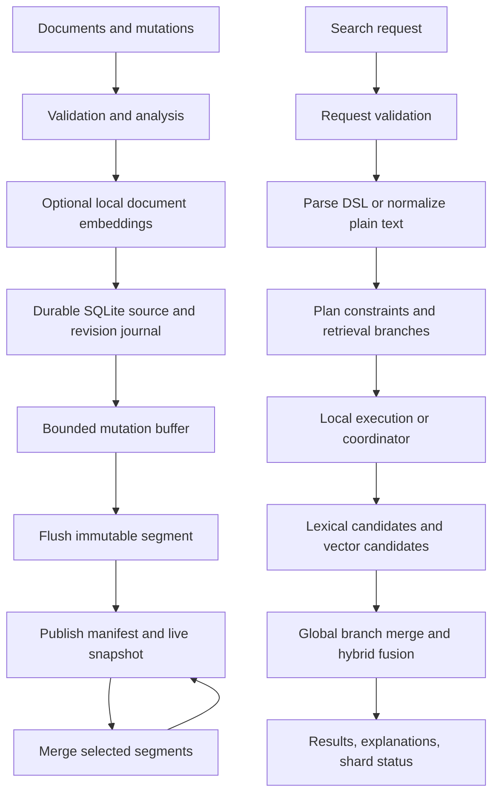

# Prism — Build Specification

> **Single source of truth for the first GitHub release.** Build a working, explainable hybrid search engine in dependency order. The intended implementation agent is **GPT-5.6 Sol**, as selected by the project owner. This specification describes a target implementation; it does not claim that any feature or benchmark already exists.

**Release target:** `v0.1.0`  
**Scope:** an educational search infrastructure project with a reproducible local deployment  
**Language:** Python 3.11; verify compatibility and lock exact dependency versions during setup  
**Primary workload:** English products, services, and short documents  
**Core evaluation scale:** approximately 5,000 public benchmark documents plus a small original marketplace fixture  
**Secondary scale experiment:** 50,000 synthetic documents; report separately  
**Specification date:** 2026-09-29

## Contents

1. [Vision and success](#1-vision-and-success)
2. [Scope and non-goals](#2-scope-and-non-goals)
3. [Technical decisions](#3-technical-decisions)
4. [Architecture and component contracts](#4-architecture-and-component-contracts)
5. [Data model and analysis](#5-data-model-and-analysis)
6. [Segmented inverted index and durability](#6-segmented-inverted-index-and-durability)
7. [Compression and postings traversal](#7-compression-and-postings-traversal)
8. [Query language, AST, planning, and execution](#8-query-language-ast-planning-and-execution)
9. [Typo tolerance and synonyms](#9-typo-tolerance-and-synonyms)
10. [Semantic retrieval and hybrid ranking](#10-semantic-retrieval-and-hybrid-ranking)
11. [Distributed search](#11-distributed-search)
12. [API contracts](#12-api-contracts)
13. [Observability and performance](#13-observability-and-performance)
14. [Relevance lab, datasets, and benchmarks](#14-relevance-lab-datasets-and-benchmarks)
15. [Repository structure and developer commands](#15-repository-structure-and-developer-commands)
16. [Implementation phases and acceptance criteria](#16-implementation-phases-and-acceptance-criteria)
17. [Testing strategy](#17-testing-strategy)
18. [Failure cases and required behavior](#18-failure-cases-and-required-behavior)
19. [GitHub hygiene and documentation](#19-github-hygiene-and-documentation)
20. [Definition of done](#20-definition-of-done)
21. [Final agent execution prompt](#21-final-agent-execution-prompt)
22. [Technical references](#22-technical-references)

## 1. Vision and success

Prism finds relevant indexed items when the user's wording differs from the stored text. It combines exact keyword retrieval, bounded spelling variants, curated synonyms, and embedding similarity. Applications supply their own documents; Prism searches that supplied collection.

| Stored item | User query | Expected capability |
| --- | --- | --- |
| Wireless noise-cancelling headphones | headset for blocking outside sound | Semantic retrieval and curated synonyms |
| AC repair and maintenance | my air conditioner is not cooling | Semantic service discovery |
| Bluetooth earbuds | bluetooh earbud | Typo tolerance |
| Distributed storage handbook | document about keeping data available across machines | Semantic document discovery |
| Apple phone repair | phone repair, with `kind = service` | Retrieval with a strict metadata filter |

"Understands intent" means measurable retrieval of relevant items. Similarity is an estimate, not a guarantee of reasoning, truth, or the user's exact intent. Irrelevant nearest neighbors are possible. Return identifiers, text, and ranking evidence; do not generate answers or invent items.

The release must demonstrate four outcomes:

1. A custom persistent lexical engine with immutable segments, compression, phrase/Boolean execution, and BM25.
2. Real semantic search that retrieves some relevant documents without exact term overlap, plus reproducible hybrid fusion.
3. A coordinator that searches multiple shard processes, selects snapshot replicas, and reports timeouts and partial results honestly.
4. A relevance and performance report that compares Prism with an established engine and documents limitations.

Completion in one continuous implementation run is a workflow goal. A remaining usage percentage is not a reliable estimate of available coding time or tokens. Prioritize the core, record checkpoints, and preserve a runnable project if resources or external prerequisites interrupt the run.

## 2. Scope and non-goals

### Must-have core

| Area | Required for `v0.1.0` |
| --- | --- |
| Storage | Custom segmented inverted index, stored documents, live document tracking, durable accepted mutations, explicit refresh, merge, restart recovery |
| Compression | Document/position deltas, unsigned variable integers, dictionary prefix compression, block skip metadata; plain reference codec for comparison |
| Lexical retrieval | Per-field BM25, phrases, Boolean operators, field groups, typed metadata filters, deterministic ordering |
| Query pipeline | Lexer, recursive-descent parser, typed AST, planner, bounded execution, explain output |
| Query understanding | Bounded edit-distance variants and curated single/multiword synonym expansion |
| Semantic retrieval | Real local embedding model, persisted normalized vectors, exact cosine retrieval, model compatibility checks |
| Hybrid search | Independent lexical/dense candidate lists, global reciprocal rank fusion, strict filter preservation |
| Distribution | Static shard map, deterministic routing, three logical shards, immutable snapshot replicas, health tracking, one bounded failover attempt, deadlines and partial responses |
| Interfaces | Python API, CLI, HTTP API, generated OpenAPI schema, relevance lab CLI with static HTML report |
| Evidence | Unit/integration/fault tests, original judged fixture, public retrieval dataset, OpenSearch lexical baseline, measured latency and index size |
| Delivery | CI, lockfile, local demo, architecture/storage/query/API docs, honest benchmark report, license and attribution |

### Stretch goals — implement only after the entire core passes

- HNSW through an established library, with exact-vector retrieval retained as a recall oracle.
- Block-max WAND, SIMD/native postings decoding, memory-mapped dictionaries, or a Rust/C++ hot path.
- Cross-encoder reranking, learned fusion weights, domain-specific embeddings, multilingual analyzers.
- Prefix/autocomplete, stemming, proximity/slop queries, highlighting, facets, aggregations.
- Adaptive fuzzy thresholds, learned spelling correction, synonym hot reload.
- Live distributed ingestion, streaming replication, automatic primary election, shard reassignment/rebalancing, consistent hashing for topology changes.
- Hedged requests, distributed caching, authenticated multi-tenant service, production deployment automation.
- Rich browser dashboard or hosted demo.

Stretch features must be labeled in the roadmap. Interfaces may leave room for them, but empty implementations and fake distributed components do not satisfy core requirements.

### Non-goals for this release

- Web crawling, searching the whole internet, general recommendation engines, or an LLM chatbot.
- Rebuilding Lucene, Elasticsearch, or OpenSearch feature parity.
- Billion-document scale, production availability guarantees, consensus protocols, or automatic cluster recovery.
- Training an embedding model from scratch or requiring paid embedding APIs.
- Arbitrary user-defined schemas, joins, SQL compatibility, or deep pagination.
- PDF/OCR ingestion, long-document chunking, images/audio, and unrestricted multilingual search.
- Claiming calibrated confidence from BM25, cosine similarity, or fusion scores.

## 3. Technical decisions

Use a single Python package so implementation effort goes into retrieval and correctness. Keep the server, CLI, and lab as adapters over the same engine.

| Decision | Default | Reason and boundary |
| --- | --- | --- |
| Runtime | Python 3.11 | Accessible implementation and broad library support; document the tested patch/platform |
| Packaging | `pyproject.toml`, `uv.lock` | Repeatable installation; choose a compatible dependency set, then pin it |
| HTTP | FastAPI, Pydantic, Uvicorn, HTTPX | Schema validation, OpenAPI, async shard fan-out |
| Math | NumPy | Exact batched vector scoring and compact arrays |
| Embeddings | Sentence Transformers, `sentence-transformers/all-MiniLM-L6-v2` | Small English model producing 384-dimensional embeddings; pin a tested model revision |
| Durable mutation journal | SQLite in WAL mode, `synchronous=FULL` | Transactional source documents and revisions; custom search postings remain in Prism files |
| Search index | Prism binary segments | Do not delegate lexical search to SQLite FTS, Lucene, or OpenSearch |
| Vector index | Exact cosine over live vectors | Adequate for the core corpus; document linear scan cost |
| Query parser | Handwritten lexer and recursive descent | Small explicit grammar, useful error spans, inspectable AST |
| Fuzzy dictionary | BK-tree over normalized vocabulary | Implement bounded Levenshtein search; cap visited nodes and expansions |
| Synonyms | Versioned JSON configuration | Curated and reproducible; expand queries rather than changing stored positions |
| Ranking | BM25 plus weighted RRF | Avoid direct addition of incomparable score scales |
| Telemetry | Structured logs and Prometheus metrics | Stage timings, histograms, bounded metric cardinality |
| Tests | pytest, Hypothesis, HTTP client fixtures | Verify semantics, format invariants, restart and deadline behavior |
| Formatting/types | Ruff, mypy | Keep configuration pragmatic and CI reproducible |
| Comparison engine | Pinned OpenSearch container | An established lexical baseline, isolated from Prism runtime |

The model's [published model card](https://huggingface.co/sentence-transformers/all-MiniLM-L6-v2) describes its dimensions and truncation behavior. The implementation must record the actual tokenizer limit and model revision. A model download is an explicit setup command, never an implicit side effect of a search request. The core runs without paid services.

### Implementation constraints

- Use third-party libraries for HTTP, embeddings, numeric operations, and durable transactions.
- Implement Prism's analyzer contract, codecs, postings traversal, AST/planner, BM25, fusion, and coordinator logic.
- Avoid microservices for every component. Deploy one local server, or a coordinator plus shard servers.
- Run CPU-heavy indexing and embeddings through bounded workers, not directly inside the HTTP event loop.
- Keep a small immutable `SearchSnapshot` interface shared by single-node and shard execution.
- Prefer complete narrow behavior over expanding the feature set before acceptance criteria pass.

## 4. Architecture and component contracts



Single-node search executes the same plan against one shard. Distributed mode adds RPC and global merging; it must not implement a second set of query semantics.

| Component | Input | Output / responsibility |
| --- | --- | --- |
| Analyzer | Field text, analyzer version | Tokens with normalized term, position, offsets |
| Mutation store | Validated upsert/delete | Durable revision and canonical state |
| Segment writer | Changes through revision `r` | Complete immutable segment with checksums |
| Snapshot publisher | Segment set, live map, statistics | Atomically published manifest generation |
| Segment reader | Validated manifest | Posting iterators, stored documents, vectors |
| Merger | Snapshot and selected segments | Replacement segments preserving live search semantics |
| Parser | DSL text | Typed AST or error with location |
| Planner | AST/free text, snapshot statistics, limits | Eligibility expression and retrieval branch plan |
| Lexical executor | Plan, snapshot, deadline | Ranked lexical candidates and completion status |
| Vector retriever | Normalized query vector, eligibility mask | Ranked dense candidates and completion status |
| Ranker | Complete branch lists | Deterministic fused hits and explanation components |
| Coordinator | Request, static topology | One logical result per shard, global merge, failures |
| Lab | Queries, judgments, runs | Relevance metrics, per-query diagnostics, report |

Required value objects: `Document`, `Mutation`, `AnalyzerConfig`, `SegmentMeta`, `Manifest`, `SearchSnapshot`, `QueryAST`, `QueryPlan`, `Candidate`, `SearchResult`, `ShardStatus`, `Deadline`.

Use immutable request/snapshot objects where practical. Snapshot readers hold references to the generation they started with; a publish or merge must never mutate their view.

## 5. Data model and analysis

### Fixed document schema

```json
{
  "id": "svc-ac-001",
  "title": "AC repair and maintenance",
  "body": "Service for air conditioners that stop cooling or leak water.",
  "kind": "service",
  "category": "home_services",
  "tags": ["air_conditioner", "repair"],
  "price": 750.0,
  "rating": 4.6
}
```

- `id`: nonempty UTF-8 external identifier, maximum 128 bytes; stable across upserts.
- `title`, `body`: analyzed text; title required, body may be empty.
- `kind`: `product`, `service`, or `document`.
- `category`: optional keyword string; `tags`: optional array of keyword strings.
- `price`, `rating`: optional finite nonnegative numbers; rating in `[0, 5]`.
- Metadata comparisons never coerce strings into numbers. Missing values do not satisfy an equality/range filter.
- Unknown fields are rejected in the core API. Arbitrary metadata is a future schema feature.
- Limit total text to 64 KiB per document, title to 1 KiB, and the configured bulk byte limit. No silent content truncation at ingestion.

Public benchmark documents map to `kind=document`, title/body from the dataset, and stable original identifiers. Missing metadata remains absent.

### Analysis rules

1. Normalize text with Unicode NFKC and `casefold`.
2. Tokenize contiguous Unicode letters/digits; underscores and punctuation split lexical text.
3. Preserve token sequence positions and offsets; phrase evaluation is field-local.
4. Index title and body separately. No stemming or stopword removal in core, keeping phrases and baseline alignment simple.
5. Keyword metadata is normalized separately with NFKC and casefold; preserve original stored values for display.
6. Analyzer configuration and implementation version are part of every manifest and run report.

The analyzer must be identical on ingestion and query processing. A configuration change requires reindexing into a new generation. Quoted phrases use the same tokenization; punctuation does not add fake positional gaps.

### Identity and mutations

- Each shard allocates monotonic mutation revisions and segment-local numeric document identifiers.
- A document version is identified by external ID plus mutation revision.
- Upsert replaces the previous version after refresh; delete removes that ID after refresh.
- At any visible snapshot, at most one live version of an external ID can be returned.
- Deleted IDs can be reinserted with a later revision.
- A valid repeated delete of an unknown ID is an accepted no-op mutation with deterministic API behavior.
- One writer owns each shard data directory. Reject a second writer using an exclusive lock.

## 6. Segmented inverted index and durability

### Disk layout

```text
data/<index>/<shard>/
  source.sqlite             # Durable source documents and ordered mutation journal
  CURRENT                   # Atomic pointer to a manifest filename
  manifests/
    manifest-000042.json
  generations/
    gen-000042/
      live-docs.bin          # External ID -> segment/local ID/revision; deleted IDs absent
      stats.json             # Live corpus/field lengths and document frequencies
  segments/
    seg-<uuid>/
      segment.meta.json      # Version, revisions, checksums, analyzer/model IDs
      terms.dict             # Sorted field-term dictionary, offsets, df
      postings.bin           # Document IDs, term frequencies, position offsets
      positions.bin          # Position deltas
      skips.bin              # Per-block bounds and byte offsets
      documents.jsonl        # Canonical stored document versions
      doc-offsets.bin        # Random access offsets
      field-lengths.bin      # Per-document analyzed field lengths
      mutations.jsonl        # Upsert/delete identities and revisions for this segment
      vectors.f32            # Optional normalized vector rows
      vector-docids.bin      # Vector row -> local document ID
  staging/                   # Incomplete builds; never searched
  writer.lock
```

JSON is acceptable for small manifests, stored source records, and statistics. Posting lists and positions must use Prism's binary format. Live maps may initially use compact serialized tables loaded into memory; document their memory cost. Keep segment files immutable, including deletion state.

### Accepted, visible, and durable

An ingestion response means the validated mutation has committed to the durable source journal. It does not promise immediate search visibility. Return `accepted_revision` and the currently visible revision.

`refresh` builds a segment from journal changes after the current visible revision through a captured high-water revision. Coalesce repeated mutations for an ID within the flush interval to its final state. A delete is represented by a tombstone mutation; an upsert supplies a new document version and postings.

The publisher builds a new live map and live corpus statistics, then atomically switches `CURRENT` only after all referenced files are complete, checksummed, closed, and flushed. Searches pin the previous or new complete generation. Every published generation contains a consistent document, postings, metadata, and vector view.

Default thresholds: refresh every 1,000 accepted mutations, 32 MiB buffered text, or one second when a writer is active. The interval is a scheduling target, not a visibility SLA; embeddings and flush work can delay publication. Serialize flush/merge publication with one writer lock. Put backpressure on accepted work if journal growth or queued embeddings exceeds limits.

### Source journal implementation

SQLite stores current canonical document state, monotonic revision allocation, and mutation records in one transaction. Store any computed embedding with its content hash and model fingerprint in the same mutation. Set WAL mode and full synchronization; validate actual filesystem behavior on the target platform.

Build from a stable SQLite read transaction and captured revision. Retain journal entries until a later published checkpoint makes them unnecessary for recovery. Do not prune source documents needed for full rebuilds. SQL serves durability and canonical state; search terms, phrases, and ranking use Prism's own index.

### Recovery and format safety

1. Read `CURRENT`, validate the manifest and every referenced checksum/version.
2. Ignore unreferenced staging files and segments for search.
3. Reopen the last valid referenced snapshot; if none is valid, fail startup with `INDEX_CORRUPT` rather than silently dropping accepted data.
4. Compare visible revision with durable journal revision and rebuild the accepted tail on refresh.
5. A crash before pointer publication leaves the previous snapshot visible. A crash after publication must reopen the new complete snapshot.
6. Reject unknown major storage versions; never interpret a corrupt length or offset as an allocation request.

Use same-filesystem staging and atomic replacement. On Windows, close handles before replacement; retain old segment files until readers release them. Test process termination around publication boundaries. Document that hardware/filesystem durability still depends on the host honoring flush operations.

### Merge policy

Start with a simple bounded merge: when there are more than eight segments, merge up to four of the smallest compatible segments. Rebuild only live versions from the pinned input snapshot; remove obsolete postings and tombstones made redundant by the output live map.

Merges publish a new generation without changing logical document state or visible mutation revision. Validate document sets, phrase matches, scores within tolerance, and vector results before/after a merge. Do not permit a merge of an old snapshot to overwrite a newer refresh; serialize publishers and verify their input generation.

Readers keep old snapshots alive until released. Garbage collection removes only files unreachable from active snapshots and retained manifests. A small corpus may not need a sophisticated merge scheduler; expose a manual `compact` command for deterministic demonstrations.

## 7. Compression and postings traversal

The binary format is versioned and documented in `docs/storage-format.md`, including byte order, integer widths, checksums, and decoding limits.

### Required codecs

| Data | Representation |
| --- | --- |
| Posting document IDs | Strictly increasing IDs encoded as nonnegative gaps with unsigned variable integers |
| Term frequencies | Positive unsigned variable integers |
| Positions within a field/document | Increasing positions encoded as gaps; reset at each document |
| Dictionary strings | UTF-8 prefix compression between neighboring terms within bounded blocks |
| Dictionary restarts | Full first term every 32 terms, plus block offsets for lookup |
| Posting blocks | Up to 128 documents per block, with independent decoding start state |
| Skip metadata | Block first/last doc ID, count, and byte offsets for posting/position streams |
| Stored document offsets | Fixed-width unsigned little-endian offsets |
| Vectors | Little-endian float32 rows, no lossy quantization in core |

`advance(target_doc_id)` skips blocks whose maximum ID is below the target, then decodes the selected block. This is a traversal optimization, not block-max scoring. Provide `next()`, `doc_id`, `tf`, and lazy `positions()` on a shared iterator interface.

Do not decode positions for plain keyword queries. Validate maximum varint length, file bounds, monotonically increasing IDs/positions, and positive term frequencies. A decoded zero gap is allowed only where the first absolute ID/position encoding requires it; duplicates are invalid.

Implement an uncompressed reference codec storing equivalent records with fixed-width integers. Compare identical indexed content under both codecs. Report dictionary/postings/positions bytes separately; exclude vectors, source journal, and stored source text from the postings compression ratio. Report full index size too.

Acceptance requires lossless round trips, correct iterator results, corruption rejection, and smaller compressed postings on the deterministic benchmark fixture. Query/indexing latency improvements are measured outcomes; compression may increase CPU cost.

## 8. Query language, AST, planning, and execution

### Two explicit query modes

`query_mode=plain` treats `q` as ordinary user text. `AND`, `OR`, punctuation, and colons have no DSL meaning. Analyze text for scoring, use OR-style lexical retrieval, and independently retrieve semantic neighbors. Structured `filters` always restrict eligibility.

`query_mode=dsl` parses an exact lexical/filter expression. Its complete AST is a hard eligibility condition. In hybrid mode, dense retrieval may rank eligible documents, but cannot bypass phrases, required terms, Boolean exclusions, or metadata constraints.

Default to `plain`. This distinction makes natural wording useful while keeping an explicit query language predictable.

For DSL semantic/hybrid requests, build embedding text from positive text terms/phrases in source order, excluding operators, field names, metadata filters, and negated clauses. If the DSL contains no positive text, require `mode=lexical`; reject a semantic/hybrid request with `QUERY_TYPE_ERROR`. A filter-only lexical query returns eligible documents in stable ID order. Explain output includes the actual dense input text.

### Supported DSL examples

```text
"distributed systems" AND reliability
category:books
rating:>=4
title:(database OR storage)
NOT beginner
kind:service AND ("air conditioner" OR cooling)
(database OR storage) AND NOT beginner
```

`category:books` is valid syntax even when the corpus has no such category. The example names a filter value, not a fixed schema enum.

### Grammar

```ebnf
query       = or_expr, EOF ;
or_expr     = and_expr, { "OR", and_expr } ;
and_expr    = unary, { ("AND" | implicit_and), unary } ;
unary       = [ "NOT" ], primary ;
primary     = "(", or_expr, ")" | field_group | field_value | phrase | term ;
field_group = text_field, ":", "(", or_expr, ")" ;
field_value = field, ":", [ comparator ], (term | phrase | number) ;
comparator  = ">=" | "<=" | ">" | "<" | "=" ;
phrase      = '"', escaped_text, '"' ;
```

Implement implicit AND only between adjacent primaries/unaries; document lexer rules for quoted escapes (`\"`, `\\`). Precedence: `NOT` > `AND` > `OR`. Operators are uppercase DSL keywords. Repeated `NOT` may be supported through recursive unary parsing; make the grammar and tests agree.

- Text fields: `title`, `body`; an unfielded text term searches either field.
- Keyword fields: `kind`, `category`, `tags`; `tags:x` means membership.
- Numeric fields: `price`, `rating`; comparison operators accepted only here.
- Field groups apply only to text fields. Nested conflicting field scopes are rejected to avoid ambiguous inheritance.
- Phrase terms must occupy consecutive positions within one field; a title token cannot join a body token.
- `NOT` complements against the pinned live-document universe, not all historical versions.
- Filter-only and pure-negative DSL queries are valid. Lexical scores may all be zero, ordered by external ID.
- No wildcards, regexes, boosts, field existence operators, or proximity syntax in core.
- Empty/whitespace queries are rejected; there is no implicit match-all endpoint.

### AST and planner

Nodes: `Term`, `Phrase`, `FieldScope`, `KeywordFilter`, `RangeFilter`, `And`, `Or`, `Not`. Include source spans and resolved field/type information. Validation resolves schema names before any postings are opened.

Planning steps:

1. Enforce length, token count, AST depth, expansion, candidate, and deadline limits.
2. Parse or analyze according to query mode.
3. Build hard eligibility from DSL and structured filters.
4. Estimate term document frequencies and intersection cardinalities.
5. Evaluate selective positive terms/filters first where reordering is logically equivalent.
6. Use postings intersections/unions and bounded live-ID sets; use skip traversal for intersections.
7. Plan exact phrase checks using intersected term candidates before loading positions.
8. Add optional scoring expansions only where their semantics permit it.
9. Build separate lexical and dense retrieval branches; retain branch parameters in explain output.

Execution must respect logical results even when its internal plan changes order. Scoring comes from positive query terms; exclusions and structured filters do not add score. Deduplicate repeated analyzed query terms in core rather than silently amplifying scores.

### BM25

Use this explicitly documented variant per field:

```text
idf(t) = ln(1 + (N - df(t) + 0.5) / (df(t) + 0.5))
bm25_f(t,d) = idf_f(t) * tf_f(t,d) * (k1 + 1)
               / (tf_f(t,d) + k1 * (1 - b + b * len_f(d)/avglen_f))
lexical(d,q) = sum_f weight_f * sum_positive_terms bm25_f(t,d)
```

Defaults: `k1=1.2`, `b=0.75`, title weight `2.0`, body weight `1.0`. `N_f` counts live documents with an indexed nonempty field; `df_f` and average field length also use live document versions. Empty fields contribute zero. This is weighted per-field BM25, not a claimed BM25F implementation.

Phrase predicates control matching. Core uses their constituent positive terms for scoring and no extra phrase boost. Alternatives generated by a single synonym/typo group use the maximum weighted alternative contribution per group, avoiding inflated scores from repeated matching variants. Explain that expanded-query scores differ from the exact baseline.

Use a bounded top-k heap, stable tie-break by external ID, and float64 accumulation. CPU and postings work must be interruptible between bounded blocks. Cancellation returns an explicit incomplete status or raises a typed budget error; it never labels incomplete work as exact.

OpenSearch's [BM25 documentation](https://docs.opensearch.org/latest/search-plugins/keyword-search/) describes score changes between major versions. Compare rankings and relevance metrics; do not assert raw score equality across engines.

## 9. Typo tolerance and synonyms

### Bounded fuzzy search

Build a BK-tree over the current live vocabulary. Use standard Levenshtein distance so BK-tree metric pruning is valid; transposition costs two edits in core. Include a bounded dynamic-programming reference implementation and validate the tree against it.

Default behavior for plain text:

- Always retain exact terms.
- Expand only terms absent from the indexed vocabulary; do not rewrite valid words automatically.
- Length below four characters: no fuzzy expansion.
- Length four through seven: at most one edit; length eight or more: at most two edits.
- Search at most 2,000 tree nodes per token, at most eight alternatives per token, and at most 32 alternatives per request across fuzzy and synonym expansion.
- Prefer lower edit distance, then greater live document frequency, then lexical term order.
- Score fuzzy alternatives at weight `0.7`; an exact term retains weight `1.0`.
- Report a truncated expansion search as `expansion_limited=true`; do not claim all eligible vocabulary variants were enumerated.

Core DSL predicates are exact. Optional expansions may affect ranking of already eligible DSL documents, but must not relax its eligibility AST. There is no `term~2` syntax in this release.

Do not fuzzy-expand numeric tokens, quoted phrases, metadata values, or identifier-like tokens configured as protected. Protect model numbers/SKUs through an explicit analyzer/query policy; document its simple heuristic. The goal is bounded recall improvement without silently matching a different product number.

### Synonym configuration

```json
{
  "version": "demo-v1",
  "rules": [
    {"from": "headset", "to": ["headphones"], "direction": "one_way"},
    {"from": "air conditioner", "to": ["ac"], "direction": "one_way"},
    {"from": "noise cancelling", "to": ["blocking outside sound"], "direction": "equivalent"}
  ]
}
```

Normalize both sides through the analyzer. Convert equivalent rules into explicit directed mappings at configuration load. Apply longest matching input phrase first, once per query; never recursively expand expansions. Keep original terms and use a maximum of four alternatives per matched rule within the overall request cap.

Multiword output alternatives become phrase scoring clauses with actual positions. They are not flattened into arbitrary OR terms. Apply synonym expansion only to unquoted plain-text spans by default. No expansion inside filters or exact DSL phrase predicates. Weight synonym alternatives at `0.8`; expose applied rules and version in explanations.

Reject empty rules, invalid directions, excessive rule size, and incompatible analyzer versions. Indexing remains unchanged when synonyms change; update query configuration and invalidate the relevant cache. Cycles cannot cause recursion because expansion is one pass.

Fuzzy and synonym matching are independent of semantic retrieval. Report their individual contribution through ablation runs instead of crediting every improvement to embeddings.

## 10. Semantic retrieval and hybrid ranking

### Embedding contract

`EmbeddingProvider` exposes `encode_documents(texts)`, `encode_query(text)`, `dimension`, `model_id`, `revision`, `normalization`, and `fingerprint`.

Use the real Sentence Transformers provider for the demo and relevance evidence. A deterministic fake provider is allowed only in isolated tests and must be visibly labeled. Hash vectors or random vectors are not semantic-search implementations.

Document embedding text is `title + "\n" + body`. Record its template version and content hash. The model may truncate beyond its tokenizer limit: make that visible in ingestion metadata/reporting, and document that dense retrieval covers only the encoded prefix. Lexical indexing still covers all accepted text. Long-document chunking is stretch work.

- Encode in bounded batches on CPU and normalize to unit length.
- Persist finite float32 values; validate dimension and reject zero/NaN/Inf vectors.
- The query uses the same model revision/template conventions as indexed vectors.
- Never mix embedding fingerprints in one searchable collection epoch.
- A model change requires re-embedding and a new snapshot epoch.
- Cache embeddings by fingerprint and exact input hash, with an explicit size bound.
- Run model inference through a bounded worker. Check the deadline before and after inference, and stop scheduling new work after cancellation. A running native model call may finish in the background; never claim hard preemption.

Ingestion into a vector-enabled index computes embeddings before committing mutations. An embedding failure rejects the affected batch atomically; it must not publish documents with silently missing vectors. Lexical-only indexes are valid, but semantic/hybrid requests then fail with `SEMANTIC_UNAVAILABLE` unless the caller explicitly allows lexical fallback.

### Exact vector retrieval

For normalized vectors, cosine similarity is their dot product. Scan live eligible rows in blocks, track top `candidate_k`, and resolve rows to external IDs. Apply hard eligibility before candidate selection, so a selective filter cannot lose all relevant neighbors through a global top-k followed by post-filtering.

Default `candidate_k=100`, maximum `1,000`, `top_k=10`, maximum `100`. Require `candidate_k >= top_k`. Exactness applies to the computed vector similarities over the eligible live rows; the embedding model itself remains an approximation of relevance.

Use all live eligible vectors for the exact scan. If the deadline expires, mark that branch incomplete. A core request either uses complete lists from successful shard attempts or reports degradation/partial work; it must not treat a prefix scan as exact nearest-neighbor retrieval.

Persist vectors alongside the indexed document versions. Upsert/delete/merge behavior must preserve the same live version in lexical and dense retrieval. Vectors are not recomputed during merges when model fingerprints match.

### Retrieval modes

| `mode` | Behavior |
| --- | --- |
| `lexical` | BM25 over eligible lexical matches; optional plain-text expansions |
| `semantic` | Exact dense ranking over all eligible documents; no lexical match requirement in plain mode |
| `hybrid` | Independent lexical and dense top lists, followed by weighted RRF |

Default mode is `hybrid` for a vector-enabled collection, otherwise `lexical`. The HTTP request always reports the requested and executed mode. Tests and benchmarks specify modes explicitly.

### Reciprocal rank fusion

```text
RRF(d) = sum over available branches b of w_b / (rrf_constant + rank_b(d))
```

Ranks begin at one. Defaults: lexical weight `1.0`, semantic weight `1.0`, `rrf_constant=60`. A missing document in a branch contributes zero. Deduplicate by external ID and break equal fusion scores by external ID. Scores are ranking signals, not probabilities.

Do not add raw BM25 and cosine scores. OpenSearch's [RRF documentation](https://docs.opensearch.org/latest/vector-search/ai-search/hybrid-search/rrf/) explains the motivation for rank-based combination; Prism's exact formula above is the implementation contract.

Candidate fusion is approximate relative to fusion over complete corpus rankings. Expose `candidate_k`, truncation, and branch completeness. If a candidate appears below `candidate_k` in one branch, its contribution from that branch is unknown and treated as absent for the defined truncated fusion. Evaluate candidate depths `50`, `100`, and `200` on development judgments and freeze the selected default.

### Explainability

With `explain=true`, a hit can include:

- Matched original terms, fields, phrase predicates, and expansion rules.
- Per-term `tf`, `df`, field length, average length, `idf`, weight, BM25 contribution.
- Dense similarity, model fingerprint, dense branch rank.
- Lexical branch rank, RRF constant, branch weights, contributions, final score.
- Eligibility filter/DSL decisions, shard ID, snapshot epoch, and document revision.

Describe dense evidence as vector similarity. Do not invent a model-generated causal explanation of why a result matches. Explanation work is bounded and excluded from default performance measurements.

## 11. Distributed search

### Realistic core topology

Build a working coordinator with three logical shards. Each shard has a primary search process and one replica search process, both serving the same immutable exported snapshot. These may run on one machine in separate processes or containers; this proves the protocol and failure behavior, not multi-host availability.

Distributed core is **read-only after an explicit build-and-export step**. Local ingestion, refresh, and compaction happen through the builder. Export a complete collection epoch, copy it to replica directories, validate checksums, then update the static topology. The distributed ingestion endpoint returns `DISTRIBUTED_WRITES_UNSUPPORTED` with the documented builder command.

Live replication, automatic failover of writes, elections, and reassignment belong to stretch scope. Snapshot replicas are sufficient for core read failover because their content and ranking statistics match.

### Routing and snapshot identity

```text
shard_id = int.from_bytes(SHA256(external_id_utf8)[:8], "big") % shard_count
```

Use the same fixed shard count while building and serving an epoch. Never use Python's randomized `hash()`. Changing shard count requires rebuilding/exporting. Search fans out to all logical shards unless a trusted internal request explicitly selects shards.

Each exported collection epoch includes:

- Epoch identifier, routing algorithm/version, shard count, schema/analyzer version.
- Per-shard manifest identity/checksum and expected document count.
- Embedding model fingerprint and dimension, when present.
- Global live per-field statistics and their fingerprint.
- Coordinator configuration for permitted endpoints and expected replica identity.

A shard reports its logical ID and epoch on readiness and every search response. A replica from the wrong epoch is ineligible. Never mix generations silently.

### Global statistics and ranking

The export step aggregates live per-field `N`, total lengths, and document frequencies across shards. Store this global statistics snapshot in the epoch and use it for shard BM25 scoring. Local IDF would make scores from differently sized shards incomparable.

Each shard returns up to `candidate_k` candidates **for each branch separately**, with raw BM25/cosine values, external IDs, and bounded document payloads. It must not return only a local fused top list.

The coordinator:

1. Deduplicates responses so one logical shard contributes once, regardless of replica attempts.
2. Merges lexical lists by comparable BM25 scores and dense lists by cosine similarity.
3. Truncates each global branch to `candidate_k`.
4. Assigns global branch ranks, then applies RRF and returns global `top_k`.

For complete exact branches, each shard returning at least global `candidate_k` is sufficient to recover the global top `candidate_k` of that branch, subject to deterministic ties. It does not make truncated hybrid fusion exact over the full corpus. In partial results, branch ranks cover only successful shards; expose that limitation.

### Deadlines, retries, and partial results

Default request budget: `500 ms`; caller range: `10–5,000 ms`. The clock starts when the handler accepts a validated request and includes queue wait, embedding, fan-out, retrieval, and response preparation. Report ingress validation time separately if excluded. Use monotonic time within each process.

The coordinator subtracts elapsed time before sending each RPC and passes remaining duration, never an absolute monotonic timestamp across hosts. The shard starts its own deadline from that remaining duration. Reserve a small configurable response margin. Network time can reduce the effective budget; outer HTTP cancellation remains the coordinator's authority.

- Track endpoint health with startup/periodic readiness checks, bounded failure counters, and cooldown.
- Attempt the preferred healthy replica first.
- Retry once on another matching replica after a transport failure, explicit unavailable response, or a shard timeout if enough budget remains.
- Never return duplicate hits or double-count a shard because the original request later completes.
- Cancel pending tasks when the coordinator deadline expires; release pooled connections and bounded work slots.
- Do not serialize shard requests. Fan-out is concurrent with a semaphore and connection pool limits.
- Keep shard-local semantic and lexical completeness separate. By default a failed required branch makes that shard attempt incomplete; lexical-only degradation is allowed only through the explicit fallback flag.

If `allow_partial=true`, return successful complete shard results with `partial=true`, failed/timed-out shard IDs, and total coverage. If `allow_partial=false`, any missing required shard produces a typed error without a normal results body. If every shard fails, return unavailable/timeout even when partial results are permitted.

Successful failover to an equivalent replica restores full logical shard coverage and does not make the response partial. Different executed retrieval modes still make it degraded and must be reported.

### Snapshot and resource limits

Configure topology from a local YAML file; reject client-supplied shard URLs. Readiness requires validated index/model/statistics fingerprints. Liveness checks process responsiveness; readiness checks ability to serve the requested epoch.

For core operations, stop traffic or start a new configured coordinator before switching epochs. Zero-downtime mixed-epoch rolling updates are stretch work. Replicas remain read-only; a coordinator restart reloads static topology and probes health.

## 12. API contracts

Serve under `/v1`. Generate OpenAPI from the implemented request/response models and commit an exported schema. Keep the examples below consistent with that schema.

| Method and path | Purpose |
| --- | --- |
| `GET /health/live` | Process liveness |
| `GET /health/ready` | Validated snapshot/provider readiness |
| `GET /metrics` | Prometheus telemetry |
| `POST /v1/indexes` | Create a local index with fixed analyzer/vector configuration |
| `GET /v1/indexes/{name}/stats` | Visible/durable revisions, live docs, segments, bytes, epoch |
| `POST /v1/indexes/{name}/documents:bulk` | Local atomic upsert batch |
| `DELETE /v1/indexes/{name}/documents/{id}` | Local accepted delete |
| `POST /v1/indexes/{name}/refresh` | Publish through at least a requested accepted revision |
| `POST /v1/indexes/{name}/compact` | Local bounded merge operation |
| `POST /v1/indexes/{name}/search` | Local or distributed search |

Core index creation is local administration. Distributed indexes/topology are loaded from configuration; the coordinator does not pretend to manage a live cluster.

### Search request

```json
{
  "q": "my air conditioner is not cooling",
  "query_mode": "plain",
  "mode": "hybrid",
  "filters": [
    {"field": "kind", "op": "eq", "value": "service"},
    {"field": "rating", "op": "gte", "value": 4}
  ],
  "top_k": 10,
  "candidate_k": 100,
  "typo_tolerance": true,
  "synonyms": true,
  "timeout_ms": 500,
  "allow_partial": true,
  "allow_lexical_fallback": false,
  "explain": false
}
```

Structured filters are ANDed. Operators: `eq` for keyword/numeric fields, `in` for keyword values including tag membership, and `gt/gte/lt/lte` for numeric fields. A DSL predicate and structured filter both apply; contradictions legitimately return no hits.

### Search response shape

```json
{
  "request_id": "req-example",
  "requested_mode": "hybrid",
  "executed_mode": "hybrid",
  "took_ms": 42.7,
  "partial": false,
  "degraded": false,
  "snapshot_epoch": "demo-001",
  "coverage": {"successful": 3, "total": 3},
  "shards": [
    {"id": 0, "status": "ok", "replica": "shard-0-a", "attempts": 1},
    {"id": 1, "status": "ok", "replica": "shard-1-b", "attempts": 2},
    {"id": 2, "status": "ok", "replica": "shard-2-a", "attempts": 1}
  ],
  "candidate_k": 100,
  "expansion_limited": false,
  "hits": [
    {
      "id": "svc-ac-001",
      "score": 0.0327868852,
      "document": {"title": "AC repair and maintenance", "kind": "service"},
      "explanation": null
    }
  ],
  "warnings": []
}
```

This is a schema illustration, not measured latency or a real search run. Local mode reports one logical shard. Do not include an exact `total_hits` count unless it was computed; candidate count and returned hit count are sufficient for core.

### Mutation visibility contract

Bulk limit: at most 1,000 documents and 8 MiB per request. Validate the entire batch, including duplicate IDs and embeddings, before one journal transaction. Reject duplicate IDs in the same batch. Return an atomic success with `accepted_revision`; invalid batches commit no mutations. Replaying identical content is semantically safe but may allocate a new revision; do not claim exactly-once network delivery.

`refresh` accepts `through_revision`. A successful response reports a visible revision at least that high. If a deadline expires, accepted mutations remain durable and the response reports `REFRESH_PENDING`; clients can inspect stats or retry. Search does not imply read-after-write before refresh.

### Errors and limits

Use one error object: `request_id`, `code`, `message`, optional `details`/source span. Do not expose stack traces in HTTP responses.

| Status | Examples |
| --- | --- |
| `400` | Query syntax/type error, incompatible query mode |
| `404` | Unknown index |
| `409` | Index exists, writer conflict, analyzer/model/epoch mismatch |
| `413` | Bulk/document/request too large |
| `422` | Schema validation, invalid numeric/vector/filter value |
| `429` | Bounded queue/concurrency exhausted; include retry guidance |
| `503` | Required shards unavailable, semantic provider unavailable, corrupt index not ready |
| `504` | Overall deadline expired or strict complete-results request could not finish |

Defaults: query at most 2,048 characters, at most 64 analyzed terms, AST depth at most 16, at most 32 structured filters, at most 32 generated alternatives, `top_k<=100`, `candidate_k<=1,000`. No pagination in core. Bind to loopback by default; public/authenticated service deployment is outside the release scope.

## 13. Observability and performance

### Required telemetry

- Request latency histograms by bounded mode and endpoint labels; derive p50/p95/p99 from histograms.
- Stage timings: queue, analysis/parser, expansion, embedding, eligibility, postings, phrase checks, vector scan, shard RPC, global merge/fusion, serialization.
- Counters: requests/errors/timeouts, partial/degraded responses, replica retries, rejected mutations, corrupt reads.
- Gauges: live documents, segment count, pending mutations, visible/durable revisions, queued work, healthy replicas.
- Storage metrics: bytes by postings/positions/dictionary/documents/vectors/journal; flush/merge counts and durations.
- Work metrics: posting blocks decoded/skipped, candidates considered, fuzzy nodes visited, embedding cache hits/misses.
- Structured slow-query log above configurable `200 ms`, with request ID, stage durations, limits, mode, epoch, coverage, and a query hash.

Do not use raw queries, document IDs, request IDs, or arbitrary index names as metric labels. Raw query logging is opt-in; report query content in the local relevance lab where explicitly supplied. Use histograms with buckets appropriate to 1 ms through 5 seconds and state quantile accuracy in reports.

### Reference performance goals

These are engineering targets, **not measured results or release guarantees**. Record actual hardware, OS, CPU governor/power mode, RAM, storage, dependency/model versions, corpus/token distribution, and concurrency before interpreting them.

Reference profile: CPU-only laptop/desktop, at least four logical cores and 16 GiB RAM, SSD, roughly 5,000 short documents, warm index and loaded model, explain off, `top_k=10`, `candidate_k=100`.

| Workload | Initial goal |
| --- | --- |
| Local warm lexical, concurrency 1 | p50 <= 20 ms, p95 <= 75 ms, p99 <= 150 ms |
| Local warm hybrid including query embedding, concurrency 1 | p50 <= 100 ms, p95 <= 250 ms, p99 <= 500 ms |
| Three shards on one host, concurrency 1 | p95 <= 350 ms for hybrid; measure shared-host contention |
| Deadline enforcement | HTTP response within budget plus 100 ms scheduling/serialization allowance under controlled tests |
| Lexical-only bulk throughput | At least 300 documents/s for the recorded short-document fixture |
| Total memory on the core corpus | Target <= 2 GiB per full local server including the loaded model; measure RSS and subprocesses |
| Compression | Compressed postings/positions smaller than the equivalent plain codec on the reference fixture |
| Distributed coverage | With one replica down and another ready, full coverage; with all replicas of one shard down, explicit partial/strict failure |

Document embedding throughput is measured separately; do not include pretrained-model download or hide embedding time in indexing results. Dense scan complexity is `O(live_docs * dimension)`; a 50,000-document run is a scaling experiment, not a requirement to preserve the 5,000-document latency targets.

If a target is missed, identify the stage and report the measured value and likely cause. Functional correctness is a release gate. A documented performance miss can remain in `v0.1.0`; fabricated numbers or undisclosed workload changes cannot.

### Measurement protocol

Warm with at least 100 representative requests, then measure at least 1,000 requests for smoke latency and 10,000 for the final latency distribution. Repeat the final run three times where practical and show dispersion. At minimum report count, median, p95, p99, throughput, failures, and hardware metadata.

Use a client-side monotonic timer around HTTP calls for end-to-end latency. Separately report engine/stage timers and model load time. Include concurrency `1`, `4`, and `16`; use a bounded arrival-rate test to expose queuing and avoid interpreting a closed-loop test as a full capacity study.

Measure cold startup and cold first query separately. Include selective/broad filters, phrases, misspellings, OOV queries, long allowed queries, and shard failures. Do not use only a single repeated cached query. Report whether the embedding cache is enabled; retain an uncached result set for comparison. Collect error/timeout rate with every latency distribution.

## 14. Relevance lab, datasets, and benchmarks

### A. Original marketplace fixture

Create 150–300 original products/services/documents with plausible text and deliberate distractors. Include at least 60 judged queries across exact, typo, synonym, semantic paraphrase, and filtered search, with at least ten semantic queries whose relevant text has no meaningful exact query term overlap after analysis. Include negative examples such as headphones without noise cancellation and AC installation when repair is requested.

Use relevance grades `0=irrelevant`, `1=partially relevant`, `2=relevant`. Check every judged ID exists and meets required filters. Author judgments independently of Prism's current output; never label whatever the model returns as relevant.

Split queries by intent groups into development and held-out test sets with a fixed seed. Paraphrases of one intent stay in the same split. Tune synonym rules, weights, and candidate depth on development only. Freeze the test judgments before inspecting final system comparisons.

Original fixture gates on the held-out set:

- Explicit filters and DSL restrictions have zero violations.
- At least 80% of designated typo queries retrieve a judged relevant item in the top five.
- At least 70% of designated no-overlap semantic queries retrieve a judged relevant item in the top five using the real provider.
- Report paired hybrid versus exact-lexical nDCG@10 and recall@10; aim for at least 10% relative recall improvement on the semantic subset without more than 5% absolute nDCG@10 loss on the exact subset.

The final comparison target is diagnostic, not permission to modify held-out labels or remove difficult queries. If it misses, publish the miss and retain accurate semantics. Only designated small, stable semantic integration cases are suitable for deterministic CI gates.

### B. Public retrieval benchmark

Use BEIR's SciFact corpus and official relevance judgments. The [BEIR dataset registry](https://github.com/beir-cellar/beir/wiki/Datasets-available) lists SciFact as a compact retrieval benchmark with 300 test queries and roughly 5,000 documents. Preserve the archive's actual counts, split names, checksums, provenance, and licensing in `datasets/README.md`.

- Implement an explicit download/prepare command and verify the downloaded artifact checksum where published.
- Preserve original IDs, titles, abstracts, queries, and qrels. Do not modify test judgments.
- Use an official non-test split for tuning if available; otherwise freeze parameters from the marketplace development set.
- Load title/body fields consistently for every engine.
- Record the exact document embedding truncation policy. SciFact is a document workload, not proof of product/service relevance.
- Do not commit the corpus, model weights, generated vector arrays, or runtime index into Git.

### C. Scale fixture

Generate 50,000 synthetic records with a recorded seed and controlled token/field lengths, vocabulary skew, categories, and deletion/update rates. Synthetic data measures storage, indexing, and scaling; do not present it as a relevance benchmark. Avoid reproducing one repeated document and calling the result representative.

### Systems and ablations

Run these configurations over identical IDs/content:

1. Prism exact lexical, expansions off.
2. Prism lexical plus fuzzy only.
3. Prism lexical plus synonyms only.
4. Prism lexical plus both expansions.
5. Prism real semantic only.
6. Prism hybrid with frozen settings.
7. OpenSearch lexical BM25 baseline.

OpenSearch is a benchmark service only. Pin an available tested container tag and digest; never commit `latest`. Configure one primary shard and no replicas for the local lexical comparison, explicit BM25 parameters, field boosts, and an analyzer matching Prism's normalization/tokenization as closely as possible. Export representative analyzed token streams from both engines and document any mismatch. Use a bool/field scoring query consistent with Prism's per-field weighting.

Preload, refresh, and warm both systems. Use the same client location, query set, top-k, concurrency, and hardware accounting. Include OpenSearch's service RSS separately from Prism's; do not count only the client process. Exact raw scores need not match because implementations differ.

Primary external comparison is **Prism lexical versus OpenSearch lexical**. Prism hybrid versus OpenSearch lexical is an additional comparison with extra semantic capability and compute; do not present that as equal-capability evidence. An OpenSearch hybrid baseline using the same embeddings is stretch work.

### Metrics and lab output

Calculate nDCG@10, MRR@10, recall@10, recall@100, and success@5; include judged relevant-document counts. For nonnegative grades, use `gain=2^grade-1`, log2 rank discount, and ideal sorted judgments. Recall treats grades greater than zero as relevant; MRR uses the first such result. Unjudged documents count as zero for the standard offline run; identify incomplete judgments as a limitation.

For queries with no positive judgments, define these relevance metrics as zero and report their count separately; keep the same averaging convention across systems. Reject duplicate run IDs/ranks, deduplicate returned document IDs before evaluation, and never count a relevant document twice.

Keep relevance metrics separate from latency and storage metrics. If confidence intervals are shown, use paired query bootstrap with a fixed seed and documented sample count. Do not infer statistical significance from one handpicked example.

`prism lab` writes:

- Machine-readable run files with query IDs, ranks, doc IDs, scores, settings, commit hash, and dataset/model fingerprints.
- Summary JSON/CSV with per-system/per-subset metrics and completeness.
- Per-query result differences, judged relevance, branch ranks, and available explanations.
- A static HTML report allowing query/system selection and side-by-side top results without a hosted app.
- `docs/benchmark-report.md` with actual measurements, methodology, regression examples, and limitations.

Distinguish `not_run`, `failed`, and measured results. If OpenSearch, a dataset, or model download is unavailable, implement and check the runner on the original fixture, record the external blocker, and leave the comparison explicitly pending. The release cannot claim the full benchmark definition of done until a real run exists.

## 15. Repository structure and developer commands

```text
prism/
  PRISM_BUILD_SPEC.md
  README.md
  LICENSE
  NOTICE
  CONTRIBUTING.md
  SECURITY.md
  CHANGELOG.md
  pyproject.toml
  uv.lock
  .gitignore
  .env.example
  .github/
    workflows/ci.yml
    ISSUE_TEMPLATE/bug_report.yml
    ISSUE_TEMPLATE/feature_request.yml
    pull_request_template.md
  src/prism/
    __init__.py
    config.py
    models.py
    errors.py
    analysis/
    storage/                 # Journal, segments, codecs, manifest, merge, snapshots
    query/                   # Lexer, AST, parser, planner, executors
    retrieval/               # Postings, BM25, fuzzy, synonyms, vectors, fusion
    embeddings/              # Real provider, cache, test-only fake
    distributed/             # Topology, export, RPC, coordinator, health
    api/                     # Request/response schemas, routes, server lifecycle
    observability/
    lab/                     # Judgments, metrics, runs, HTML report
    cli.py
  tests/
    unit/
    property/
    integration/
    distributed/
    fixtures/
  examples/
    marketplace/documents.jsonl
    marketplace/queries.jsonl
    marketplace/qrels.tsv
    synonyms.json
    cluster.yaml
  benchmarks/
    configs/
    baseline_opensearch.py
    load_test.py
    prepare_scifact.py
    generate_scale_fixture.py
  datasets/README.md
  docs/
    architecture.md
    storage-format.md
    query-language.md
    api.md
    openapi.json
    operations.md
    relevance.md
    benchmark-report.md
    limitations.md
    decisions/
    build-status.md
  docker/
    Dockerfile
    compose.yaml
    compose.benchmark.yaml
  scripts/
    demo.py
    check_repo.py
```

Use modules when a package directory would contain only one small file; the logical boundaries above matter more than creating empty folders. API modules must call the engine rather than containing its algorithms. Generated runtime artifacts belong under ignored `data/`, `.cache/`, and `artifacts/` directories.

### Required command interface

Implement and verify these workflows; command spelling may change once during setup, then update every document/example together:

```bash
uv sync --locked --extra dev --extra semantic
uv run prism model download --config examples/local.yaml
uv run prism index create demo --config examples/local.yaml
uv run prism ingest demo --file examples/marketplace/documents.jsonl
uv run prism refresh demo
uv run prism search demo --query "my air conditioner is not cooling" --mode hybrid
uv run prism serve --config examples/local.yaml
uv run prism compact demo
uv run prism cluster build demo --shards 3 --replicas 1 --output data/cluster
uv run prism cluster serve --config examples/cluster.yaml
uv run prism lab --config benchmarks/configs/marketplace.yaml
uv run prism benchmark --config benchmarks/configs/scifact.yaml
uv run pytest
uv run ruff check .
uv run ruff format --check .
uv run mypy src/prism
```

Add the referenced `examples/local.yaml` during scaffold implementation. The `semantic` extra installs real provider dependencies; lexical-only installation must remain usable. Commands requiring downloads report the intended source and cache location. Model/dataset downloads are setup actions with retries and clear failures; tests do not fetch assets from the network.

Provide a portable Python demo launcher and documented PowerShell equivalents where shell syntax differs. Compose is optional for local engine use but required as a reproducible OpenSearch baseline path. Use shell-specific examples instead of assuming Windows has Bash or Make.

## 16. Implementation phases and acceptance criteria

Follow this dependency order. Each phase produces a runnable checkpoint and a short entry in `docs/build-status.md`: completed behavior, checks executed, actual outcome, and remaining blockers. Do not start stretch work while a core acceptance criterion remains open.

### Phase 0 — Scaffold and lock contracts

**Dependencies:** none.

Create package metadata, CLI entry point, configurations, shared models/errors, placeholder-free documentation skeleton, development tooling, and CI. Record storage/analyzer/model fingerprint conventions and default limits in configuration.

**Acceptance criteria:**

- A clean supported environment installs from the lockfile.
- `prism --help` and a configuration-validation command work.
- Invalid configuration produces typed errors, without traceback leakage in the intended CLI/API surface.
- Exact tested runtime/dependency versions are recorded; model revision/container digest are resolved when their prerequisites become available.
- CI runs formatting, lint, types, and deterministic unit tests without model downloads.
- A small architecture decision record explains Python, custom lexical files, exact vectors, and static snapshot replication.

### Phase 1 — Analyzer, canonical documents, and durable mutations

**Dependencies:** Phase 0.

Implement schema validation, analysis, SQLite transactions, revision allocation, exclusive writer lock, upsert/delete, and source export. Keep the ingestion interface independent of HTTP.

**Acceptance criteria:**

- Unicode normalization/casefold, token positions, keyword normalization, and numeric validation match the documented rules.
- Invalid bulk batches are atomic; duplicate IDs within a batch are rejected.
- Accepted upserts/deletes survive process restart with stable revision ordering.
- Upsert/delete/reinsert histories reconstruct the correct canonical state.
- A second writer is rejected; read-only access remains possible.
- No lexical-search dependency or fake semantic behavior is introduced.

### Phase 2 — Immutable segments and visible snapshots

**Dependencies:** Phase 1.

Implement the plain codec first, stored fields, field lengths, posting/position writers and readers, mutation coalescing, live maps, manifest publication, and explicit refresh. Add basic term/phrase iterator probes through the Python API.

**Acceptance criteria:**

- Multiple refreshes produce independently readable immutable segments.
- Unrefreshed accepted mutations stay invisible, and refresh through a revision makes the correct state visible.
- Deleted and obsolete versions never appear in search probes.
- Readers pinned before publication keep their complete earlier view.
- Term and phrase probes match a brute-force reference on small generated corpora.
- Restart loads exactly the referenced valid snapshot and can publish the durable tail.
- Fault injection before/after pointer publication never produces a partially referenced segment set.

### Phase 3 — Compression, skip traversal, and merge

**Dependencies:** Phase 2.

Add varints, document/position gaps, prefix dictionary blocks, restart/skip records, compressed readers, checksums, bounded merge, and safe garbage collection. Keep the plain codec available for benchmark/oracle use.

**Acceptance criteria:**

- Property tests prove round trips and posting `advance` equivalence across empty/small/multiblock lists.
- Truncated files, oversized varints, invalid offsets, unsupported versions, and bad checksums fail explicitly.
- Compressed postings/positions are smaller than the equivalent plain encoding on the fixed fixture; report actual byte counts.
- Merge preserves live IDs, term/phrase results, stored values, and visibility revision.
- Merge cannot overwrite a concurrent newer publication or remove active-reader files.
- Compaction reduces obsolete entries/segment count; source data remains rebuildable.

### Phase 4 — Parser, planner, lexical execution, and BM25

**Dependencies:** Phase 3.

Implement grammar, AST spans/types, plan inspection, Boolean/range execution, phrase constraints, live corpus statistics, BM25, top-k, deadlines, and explanations.

**Acceptance criteria:**

- Every documented DSL example has the expected parsed structure and match set.
- Precedence, escapes, implicit AND, field groups, pure NOT, missing metadata, and contradictory filters have explicit tests.
- Random Boolean plans return the same match set as a brute-force evaluator.
- BM25 matches a hand-computed reference within numeric tolerance; empty fields and updates/deletes use correct live statistics.
- Tie ordering is stable across restarts, codec choices, and compaction.
- DSL hard constraints cannot be bypassed by any scoring clause.
- Expensive queries terminate with a typed budget outcome; no unbounded recursion or full-position decoding for ordinary terms.

### Phase 5 — Fuzzy and synonym expansion

**Dependencies:** Phase 4.

Implement BK-tree lookup, bounded Levenshtein variants, protected tokens, query expansion groups, synonym load validation, and expansion explanations.

**Recorded implementation deviation (2026-09-30):** the runtime uses the BK-tree for vocabularies through 5,000 terms. Larger vocabularies use a bounded bigram candidate lookup followed by exact Levenshtein checks, with `expansion_limited` when its 2,000-candidate cap applies. A 35,931-term SciFact BK-tree built lazily inside the first fuzzy request and exceeded the five-second budget. This approximation can miss neighbors, so the large-vocabulary quality and deadline results must be disclosed. The small-vocabulary BK-tree reference acceptance check remains intact. See [decision 0002](docs/decisions/0002-bounded-fuzzy-candidates.md).

**Acceptance criteria:**

- BK-tree results equal the reference vocabulary scan when limits are not reached.
- `bluetooh` can match the indexed `bluetooth` fixture; valid exact terms remain present.
- Short tokens, numeric identifiers, quoted phrases, and filter values follow their restrictions.
- Multiword synonym clauses preserve phrase semantics, and equivalent rules do not recurse.
- Alternative/group weights match the documented scoring rule; duplicate expansion paths do not inflate scores.
- Adversarial vocabularies respect visited-node and expansion caps and report truncation.
- Original fixture typo gates pass, or a clear documented failure blocks claiming typo completion.

### Phase 6 — Real embeddings, exact vectors, and hybrid fusion

**Dependencies:** Phases 4–5 and snapshot storage.

Implement provider interface, explicit model setup, genuine embeddings, persisted vectors, live filtered cosine scan, mode handling, and RRF. Add test-only provider fixtures under test configuration.

**Acceptance criteria:**

- A real local model run retrieves designated non-exact semantic cases; save run evidence and provider fingerprint.
- Unit vector retrieval equals a simple full-sort oracle, including selective filters and score ties.
- Vectors survive restart and agree with live versions after upsert/delete/merge.
- NaN, zero vectors, dimension/model mismatch, and missing provider fail as specified.
- Hybrid fusion matches a hand-ranked example with disjoint/overlapping branch candidates.
- Semantic retrieval broadens plain-text matching while preserving every structured/DSL hard condition.
- Missing-provider fallback occurs only when explicitly requested and reports executed mode/degradation.
- Ingestion into vector-enabled indexes cannot silently accept incomplete embeddings.

### Phase 7 — HTTP API, local demo, and telemetry

**Dependencies:** Phase 6.

Expose the engine through FastAPI, finish CLI workflows, add bounded queues/workers and metrics, and implement a portable local demo.

**Acceptance criteria:**

- The documented create/ingest/refresh/search/delete/compact workflows run end to end.
- OpenAPI and examples use the real schema and documented error codes.
- HTTP validation/body limits are enforced before expensive indexing/model work.
- Accepted/visible revisions are exposed and refresh is testable as a visibility barrier.
- Readiness distinguishes a healthy process from a missing/corrupt snapshot or required provider.
- Metrics capture stage timings, errors, storage, work, and bounded-label histograms.
- CPU work does not block liveness indefinitely; queue overflow returns a bounded rejection.
- The lexical-only install works without semantic libraries or model downloads.

### Phase 8 — Exported shards, coordinator, and replica failover

**Dependencies:** Phase 7 and global snapshot statistics.

Implement deterministic partition/export, epoch metadata, real shard processes, static topology, matching replicas, async fan-out, global branch merge/fusion, failover, and partial responses.

**Acceptance criteria:**

- Three real shard processes plus replicas serve one exported corpus; no mocked-only cluster demo.
- Complete distributed lexical/dense branch rankings match the single-node reference using identical global statistics, candidates, and deterministic ties.
- Fusion occurs after global branch merge; a crafted example catches incorrect local-fusion merging.
- A failed preferred endpoint falls back once to its matching replica and returns full coverage.
- If both replicas of one shard fail, permissive mode reports its missing coverage; strict mode fails.
- All-shard failure is an error, not a successful empty list.
- Delayed responses respect the overall deadline and never count a logical shard twice.
- Wrong epoch/model/statistics fingerprints are rejected.
- Distributed mutation calls return the documented unsupported-write error.
- The cluster launch/export commands and compose configuration are reproducible.

### Phase 9 — Relevance lab and measured comparisons

**Dependencies:** Phases 7–8.

Finish original fixture judgments/splits, the static lab report, SciFact preparation, OpenSearch runner, ablations, compression comparison, latency runs, and synthetic scale experiment.

**Acceptance criteria:**

- Metric implementations match tiny manually calculated qrel/run examples, including no-relevant-document edge cases.
- Held-out judgments are frozen and every run records parameters, commit, versions, and checksums.
- All required ablations produce actual run files and summary tables.
- The real SciFact/OpenSearch lexical comparison is executed, with analyzer differences and workload limits disclosed.
- Latency results include p50/p95/p99, sample count, errors, concurrency, and hardware; indexing includes embedding cost separately.
- Lab output exposes regressions and per-query branch differences rather than only selected successes.
- Unavailable external prerequisites are shown as pending blockers, never filled with invented numbers.

### Phase 10 — GitHub release preparation

**Dependencies:** all core phases.

Complete README/docs, CI, license notices, example configuration, reproducible demo, package build, final regression checks, and limitations report.

**Acceptance criteria:**

- A clean checkout follows README instructions successfully in the supported environment.
- All core tests/checks pass; real-provider and external benchmark evidence is linked with its configuration.
- Repo history/files contain no secrets, model weights, downloaded corpora, runtime databases, or generated index artifacts.
- README clearly distinguishes implemented core, measured outcomes, limitations, and stretch roadmap.
- There are no empty feature implementations, fabricated badges, or completion claims unsupported by artifacts.
- The definition of done below is checked item by item, with incomplete external checks explicitly marked.
- The agent reports the final changes and commands/results; publishing/pushing/tagging occurs only when already authorized.

## 17. Testing strategy

Use small deterministic fixtures for fast feedback and independent reference implementations for algorithm checks. Tests must establish behavior/invariants, not repeat the same implementation in a second place.

| Layer | Required tests |
| --- | --- |
| Analyzer/schema | Unicode, casefold, punctuation, positions, maximum sizes, keyword versus numeric types |
| Codecs | Varint boundaries, delta resets, dictionary restart points, multiblock skips, truncation/corruption |
| Journal/snapshot | Atomic bulk, durable revisions, refresh visibility, live version uniqueness, reader pinning |
| Merge/recovery | Repeated updates/deletes, crash boundaries, no stale overwrite, safe file retention |
| Parser/planner | Operator precedence, source spans, malformed input, schema errors, reordered plans |
| Lexical/ranking | Phrase positions, field boundaries, Boolean oracle, BM25 formula, deterministic ties |
| Expansions | Levenshtein oracle, bounded traversal, protected tokens, multiword rules, group scoring |
| Dense/hybrid | Real provider smoke, exact scan oracle, prefilter semantics, fingerprints, RRF example |
| API/resources | Errors, body limits, visibility barrier, queue saturation, fallback flags, readiness |
| Distribution | Matching snapshots, global statistics/ranks, timeout cancellation, retry dedup, stale replica, partial coverage |
| Lab | Known metric values, split leakage checks, ID validity, reproducible runs, pending-result labels |

### Property and metamorphic invariants

- Decode(encode(values)) equals valid original values for every codec.
- Posting IDs and positions are ordered; iterator advancement never moves backward.
- Indexing batch boundaries do not change final live results after all accepted revisions are refreshed.
- Compaction changes physical files, not logical results or score order.
- Adding a nonmatching document cannot create a new exact match, although BM25 values may change through corpus statistics.
- Applying an extra AND filter cannot increase the eligible document set.
- A replica response contributes exactly one logical shard result.
- Changing process hash seed does not change shard routing.
- Every hit satisfies its pinned live map and hard constraints.

### Integration and fault tests

Start real server/shard subprocesses on ephemeral ports with temporary data directories. Inject slow handlers, transport failures, process termination, and corrupted/truncated files in controlled fixtures. Use test hooks around durable commit, file flush, manifest rename, and pointer replacement; record which boundary was interrupted.

Use conservative timing allowances to avoid flaky millisecond assertions. A deadline test must demonstrate bounded completion and resource cleanup, not merely assert a flag. Running native embedding work may finish after HTTP cancellation; test bounded scheduling and eventual worker release separately.

### CI tiers

- **Every change:** deterministic unit/property/local integration tests, lint, format, types, package build; no network/model download.
- **Core cluster suite:** subprocess distribution/failure tests with tiny fixed vectors; tests can be separate CI jobs.
- **Real semantic suite:** explicitly provisioned pinned model cache, genuine semantic smoke cases, no test-time network fetch.
- **Benchmark workflow/manual run:** provisioned corpus and pinned OpenSearch; save artifacts and actual results. Performance targets are reported rather than flaky shared-CI gates.

If a test is skipped because its dependency is absent, print its reason and report that suite as unverified. A green fast CI badge does not prove semantic relevance, benchmark completion, or production readiness.

## 18. Failure cases and required behavior

| Failure or difficult input | Required outcome |
| --- | --- |
| No lexical match | Empty lexical list; plain semantic/hybrid can still retrieve eligible items |
| Nonsense/out-of-domain query | Similarity may return weak neighbors; scores are not confidence and no item is invented |
| Valid word with wrong intended meaning | Exact term is retained; domain synonyms and dense model can still misrank; show a lab example |
| Misspelled short word or SKU | No unsafe automatic expansion under the protected/short-token policy |
| Negation in ordinary natural language | Plain embeddings may misunderstand it; recommend explicit DSL/filter constraints and document the limit |
| DSL malformed quotes/parentheses | `QUERY_SYNTAX_ERROR` with source span, no execution |
| Unknown field or string range | `QUERY_TYPE_ERROR`, no coercion |
| Empty query | Rejected; no accidental all-document scan |
| Query/AST/expansion too large | Limit error or bounded expansion flag according to the defined limit |
| Selective filter with dense retrieval | Filter eligibility before top-k; relevant eligible rows remain discoverable |
| Field missing in document | Equality/range predicate false; NOT applies to the resulting predicate normally |
| Concurrent upsert/delete and search | Search sees one pinned complete snapshot with one live version per ID |
| Crash after accepted mutation before refresh | Mutation survives in the journal; last published search view remains valid |
| Crash during segment build | Unreferenced staging ignored; accepted data rebuilt from journal |
| Corrupt referenced file | Readiness/search fail explicitly; no silent omission of the segment |
| Disk full or permission error | Mutation/flush fails clearly; published snapshot retained; accepted journal state recoverable |
| Unsupported storage/analyzer version | Refuse incompatible read or require a rebuild; no automatic reinterpretation |
| Model missing or incompatible | Explicit semantic-unavailable/mismatch outcome; caller-controlled lexical fallback only |
| Document exceeds embedding length | Dense truncation recorded; lexical content retained; limitation documented |
| Embedding output zero/NaN/Inf | Reject affected vector-enabled batch or fail query; never rank invalid values |
| Broad fuzzy/phrase query | Enforce caps/deadline; no unbounded full-vocabulary or position work |
| Preferred replica unavailable | One budgeted matching-replica retry; no duplicate logical shard contribution |
| Replica stale/wrong epoch | Exclude it and report shard failure if no matching replica is ready |
| One logical shard unavailable | Explicit partial response when permitted, strict failure otherwise |
| All shards unavailable | `503`/`504`; never normal empty success |
| Deadline during dense/native work | Bound response and further scheduling, report incomplete work; no claim of native hard preemption |
| Queue overload | `429` with bounded resource use; healthy requests/liveness remain responsive |
| Benchmark unavailable | Mark pending with concrete prerequisite; preserve runnable fixture evidence |

Also include a limitations note about ambiguous abbreviations (`AC` may mean different things), multiword synonym overreach, sparse judgments, embedding domain mismatch, and title/body truncation. Exact identifiers and explicit constraints remain useful even in a semantic engine.

## 19. GitHub hygiene and documentation

### Repository hygiene

- Use Apache-2.0 for Prism's code unless the owner supplies another license before implementation. Include the full standard license; do not invent personal author/copyright details.
- Record third-party model/data/library licenses and attribution in `NOTICE` and `datasets/README.md`. Code licensing does not relicense downloaded assets.
- Ignore secrets, `.env`, virtual environments, downloaded datasets, model caches, SQLite/WAL files, snapshots, logs, and generated reports containing runtime data. Commit `.env.example` with harmless placeholders.
- Pin Python dependencies in the lockfile, embedding revision, and container image digest. Record update/rebuild instructions.
- CI uses explicit permissions and pinned action revisions where practical. No fake workflow or coverage badges.
- Add contribution guidance, bug/feature templates, a PR template, and a security reporting policy without invented contact addresses.
- Validate index names/paths against directory traversal and treat source documents/query text as data, never executable instructions.
- Escape document/query text when rendering the HTML lab to prevent script injection.
- Run Git secret/artifact checks before any authorized publish. Keep benchmark reports and small original fixtures; exclude large generated artifacts.
- Use concise commits at stable phase checkpoints when repository operations are authorized. Do not rewrite existing user history or publish without authorization.

### README requirements

The README must let a reviewer understand and run Prism without reading the entire specification. Include:

1. One sentence describing the implemented retrieval behavior and educational scope.
2. A status table separating core implemented features, verified evidence, and stretch goals.
3. A small architecture diagram and one concrete product/service/document example.
4. Prerequisites, locked install, explicit model download, and a working lexical-only path.
5. A copyable local ingest/refresh/search workflow and HTTP request.
6. Query mode distinctions, hard filter examples, and why hybrid scores are not probabilities.
7. A real distributed demo with matching snapshots and a reproducible failure scenario.
8. Actual benchmark results with configuration/hardware links; pending work visibly labeled.
9. Testing commands and which suites require provisioned external assets.
10. Limits, supported environments, data/model licensing, operations guidance, and roadmap.

Use only demonstrations executed against the real implementation. Saved example result bodies may be shortened, but identify them as illustrations if they were not measured runs.

### Documentation requirements

| File | Required content |
| --- | --- |
| `PRISM_BUILD_SPEC.md` | This authoritative release contract and any deliberate recorded deviations |
| `docs/architecture.md` | Components, data flow, local versus distributed lifecycle, design decisions |
| `docs/storage-format.md` | Binary layout, codec examples, manifests, live maps, recovery, format versions |
| `docs/query-language.md` | Grammar, precedence, analysis rules, field types, query modes, limits |
| `docs/api.md` + `openapi.json` | Real endpoint contracts, examples, visibility, errors, completeness |
| `docs/operations.md` | Build/export/refresh/compact, restart, snapshot replicas, health, corrupt index recovery |
| `docs/relevance.md` | Model/template, synonyms/fuzzy policy, BM25/RRF, qrels, tuning protocol |
| `docs/benchmark-report.md` | Actual relevance/performance/size results, reproducibility metadata, caveats |
| `docs/limitations.md` | Exact scale/concurrency/semantic/distributed limits and performance misses |
| `docs/build-status.md` | Phase checklist, checks/outcomes, external blockers, next concrete step |
| `docs/decisions/` | Small records explaining consequential design choices/deviations |

Update docs with each implemented behavior. If a narrow design change is necessary, explain its effect, update this spec and dependent examples together, and keep the original requested core outcome. Changing a release requirement to conceal a failed implementation is not an acceptable deviation.

## 20. Definition of done

`v0.1.0` is complete only when all required outcomes have evidence:

- [ ] A custom immutable segmented lexical index survives refresh, merge, updates/deletes, and restart.
- [ ] Document gaps, varints, positional compression, prefix dictionaries, and block skipping are implemented and checked against references.
- [ ] The parser/AST/planner executes documented Boolean, phrase, field, and typed-filter queries correctly.
- [ ] BM25 and its live/global statistics are documented, tested, and deterministic.
- [ ] Typo and synonym expansion work within limits and preserve explicit query constraints.
- [ ] Real persisted embeddings retrieve designated non-exact semantic cases, with actual model fingerprints and run evidence.
- [ ] Exact vector retrieval, prefilters, and RRF are correct; incomplete/degraded modes are explicit.
- [ ] Three logical shards with real snapshot replicas demonstrate global ranking, one budgeted failover, strict failures, and partial results.
- [ ] HTTP/CLI interfaces expose accepted versus visible revisions, limits, errors, and readiness.
- [ ] Metrics/logs report stage costs, p50/p95/p99, overload, failures, and index bytes without unbounded labels.
- [ ] The original relevance lab, ablations, public SciFact run, and OpenSearch lexical comparison have real saved results.
- [ ] Performance measurements include workload/hardware/sample metadata and honestly disclose any target misses.
- [ ] Required tests and code-quality checks pass; skipped external suites are identified and cannot support completion claims.
- [ ] A clean checkout reproduces the documented demo and benchmark preparation commands.
- [ ] README, API/storage/query/operations/relevance docs, license/attribution, CI, and limitations are complete.
- [ ] No core route is a placeholder; no mocked/fake provider is presented as a genuine semantic or distributed feature.
- [ ] No secrets, large downloaded assets, or generated runtime indexes are committed.
- [ ] Remaining features are recorded as stretch work, with no unsupported production-readiness claims.

Code completion and release verification may differ if an external prerequisite is unavailable. Report that distinction precisely. A project with an unrun baseline can be a useful runnable checkpoint, but it has not satisfied the full release definition above.

## 21. Final agent execution prompt

Copy this prompt into the Prism repository session running GPT-5.6 Sol. Keep this specification in the repository root.

```text
Build Prism according to PRISM_BUILD_SPEC.md in this repository.

The objective is a complete, runnable v0.1.0 educational hybrid search
infrastructure project. Use this file as the authoritative feature, behavior,
architecture, acceptance, and release contract. Follow applicable repository
instructions and explicit owner instructions. Preserve existing user work.

Start by inspecting the repository, applicable AGENTS.md instructions, available
runtime, and existing implementation. Summarize what already exists and choose
the smallest practical path through the specified core. Do not replace working
code just to match a directory sketch.

Implement phases 0 through 10 in dependency order. Make actual code and files;
do not stop with an architecture proposal. Complete and verify each phase's
acceptance criteria before expanding scope. Maintain docs/build-status.md with
checks actually executed, outcomes, blockers, and the next unfinished step.

Use Python, custom segmented lexical files, genuine local embeddings, exact
vector search, and static exported shard snapshots as specified. Third-party
libraries may handle HTTP, embeddings, math, and durable source transactions.
Do not outsource the custom lexical engine to an existing search engine.
OpenSearch is the external benchmark baseline only.

Implement durable accepted mutations, explicit refresh visibility, one live
version per ID, checksummed atomic snapshot publication, immutable readers,
bounded merges, and recovery before optimizing. Keep query modes explicit:
plain text permits semantic discovery; DSL/structured constraints remain hard.
Use correct live BM25 statistics, global statistics in the cluster, separate
global branch rankings, and RRF only after global branch merging.

Install a compatible dependency set and commit its lockfile. Download real model
assets only through explicit setup, record the model revision, and use genuine
embeddings for semantic evidence. Fake vectors/providers belong only in clearly
labeled deterministic tests. Do not invent search intelligence or benchmark data.

Build the local engine and demo first, then the real coordinator/shard/replica
processes. Keep distributed writes and automatic rebalancing outside core.
Implement request budgets, resource caps, matching epoch checks, a bounded
replica retry, honest partial results, and explicit degraded modes.

Write meaningful tests against independent references and invariants. Run the
relevant suite at each checkpoint, fix failures, and run the required final
checks. Provision real semantic and external benchmark prerequisites separately
from deterministic CI. A skipped suite is unverified, not passed.

Create original judged marketplace fixtures, preserve held-out splits, run all
specified ablations, and compare lexical retrieval with a pinned OpenSearch
baseline on the public dataset. Save actual run/configuration metadata and
report quality, p50/p95/p99, indexing costs, memory, storage, and failures.
Never tune on test judgments or change labels to make results look better.

If a model, dataset, Docker runtime, network access, or other external prerequisite
is unavailable, continue all independent authorized work. Preserve a runnable
checkpoint and report the exact missing prerequisite and unverified criteria.
Do not fabricate completion or substitute a mock for real integration evidence.

Make routine implementation choices autonomously. Ask the owner only for a
genuine blocker or an action requiring permission that is not already authorized.
Share concise progress updates. Use subagents only when the owner or applicable
repository instructions authorize delegation. Do not add stretch features while
any core requirement is incomplete.

Keep implementation/documentation consistent. Record necessary narrow deviations
with reasons and acceptance impact. If context or usage becomes constrained,
update the checkpoint so continuation starts at the next incomplete phase;
do not silently remove core requirements or claim one-pass completion.

Finish by checking the definition of done, reviewing Git hygiene, verifying the
clean-checkout instructions, and reporting: implemented behavior, checks and
actual benchmark outcomes, incomplete external verification, known limitations,
and the next concrete step if anything remains. Commit/push/open a PR/tag/publish
only when the owner has authorized those repository actions. Never claim a
published release or passing benchmark without direct evidence.
```

## 22. Technical references

These references informed the chosen implementation and evaluation approach. Pin tested assets and versions during implementation; documentation URLs may evolve.

- [Sentence Transformers quickstart](https://sbert.net/docs/quickstart.html) — local pretrained embedding provider usage.
- [Sentence Transformers semantic search](https://sbert.net/examples/sentence_transformer/applications/semantic-search/) — embedding retrieval and query/document task considerations.
- [all-MiniLM-L6-v2 model card](https://huggingface.co/sentence-transformers/all-MiniLM-L6-v2) — model dimensions, intended use, license, and input limits.
- [BEIR dataset registry](https://github.com/beir-cellar/beir/wiki/Datasets-available) — public retrieval corpora, splits, and download metadata.
- [OpenSearch similarity documentation](https://docs.opensearch.org/latest/im-plugin/similarity/) — BM25 parameters and engine configuration.
- [OpenSearch keyword search](https://docs.opensearch.org/latest/search-plugins/keyword-search/) — lexical scoring and version-dependent BM25 behavior.
- [OpenSearch reciprocal rank fusion](https://docs.opensearch.org/latest/vector-search/ai-search/hybrid-search/rrf/) — combining rankings with different score scales.

The numerical acceptance thresholds and performance targets in this specification are project decisions, not claims taken from those sources. Measure Prism and publish its actual outcomes.


