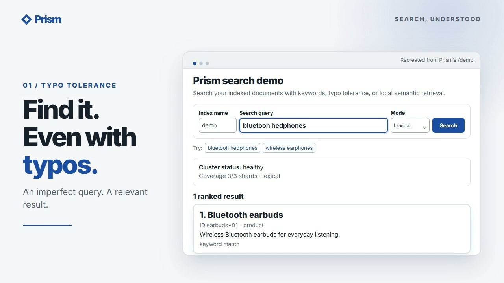

# Prism

Prism is an educational search engine for products, services, and documents. It combines a custom persistent keyword index with local embeddings, so a search for “my air conditioner is not cooling” can retrieve an AC repair service. It searches only documents you provide.

**Status:** Local search, real MiniLM retrieval, and a static snapshot cluster have been implemented and tested. Windows and Ubuntu CI cover the locked install, source checks, tests, wheel, and HTTP smoke. See [build status](docs/build-status.md) and [measured results](docs/benchmark-report.md). This is an educational implementation, not a production service.

| Capability | Implementation | Evidence |
| --- | --- | --- |
| Segmented index, updates/deletes, crash-safe publication, compression | Custom binary files plus SQLite mutation journal | Codec and fault-boundary tests |
| Phrases, Boolean DSL, filters, BM25, bounded fuzzy terms and synonyms | Local engine | Reference tests and judged fixture |
| Semantic retrieval and hybrid RRF | Local MiniLM model, exact vector scan | Real-model test and marketplace report |
| Distributed queries | Three static shards, one snapshot replica each | Real-process failover test |
| External baseline | OpenSearch BM25 on SciFact | [Benchmark status](docs/benchmark-report.md) |

## Watch the demo

[](docs/media/prism-launch.mp4)

[Watch the 22-second video](docs/media/prism-launch.mp4) for typo-tolerant and semantic search, measured SciFact relevance, and explicit shard coverage. The video recreates the project's `/demo` interface; the results shown are documented in the [benchmark report](docs/benchmark-report.md) and [operations guide](docs/operations.md).

Music: [“Happy Beats & Business Moves Vol. 12”](https://ende.app/en/song/12881-happy-beats-business-moves-vol-12) by Sascha Ende, [CC BY 4.0](https://creativecommons.org/licenses/by/4.0/).

## How it works

```text
Your documents -> journal -> immutable compressed segments -> live snapshot
                                                           | keyword/BM25
Query -> parser and filters -> keyword + vector candidates -> global RRF -> results
```

`plain` queries can find semantically similar items without matching words. `dsl` queries enforce exact phrases, Boolean expressions, and field/metadata conditions. Hybrid ranking never bypasses a hard constraint. Scores express rank, not confidence.

## Install

Use Python 3.11 and [uv](https://docs.astral.sh/uv/). The model needs about 2 GiB of available memory. Docker is needed only for the OpenSearch comparison.

```bash
uv sync --locked --extra dev --extra semantic
uv run prism model download --revision 1110a243fdf4706b3f48f1d95db1a4f5529b4d41
```

On Windows hosts that block temporary build helpers, this two-step install was verified:

```powershell
uv sync --locked --extra dev --extra semantic --no-install-project
uv sync --locked --extra dev --extra semantic --no-build-isolation
```

Omit `--extra semantic` for a lexical-only install. Model weights stay under ignored `.cache/model`. During this development run, Windows application control blocked one newer native dependency, so `scikit-learn==1.6.1` is pinned in the lockfile. Real-model checks pass with that pin.

## First search

```bash
uv run prism --config examples/local.yaml index create demo --semantic
uv run prism --config examples/local.yaml ingest demo --file examples/marketplace/documents.jsonl
uv run prism --config examples/local.yaml refresh demo
uv run prism --config examples/local.yaml search demo --query "quiet audio accessory that isolates me from busy surroundings" --mode hybrid
uv run prism --config examples/local.yaml search demo --query 'kind:service AND rating:>=4' --mode lexical --dsl
uv run prism --config examples/local.yaml serve
```

Omit `--semantic` at creation for the lexical-only path. Accepted mutations are durable and become searchable after `refresh` or the server's scheduled refresh. `index stats` reports accepted and visible revisions.

With the server on `127.0.0.1:8080`, send an HTTP search:

```bash
curl -X POST http://127.0.0.1:8080/v1/indexes/demo/search \
  -H 'Content-Type: application/json' \
  -d '{"q":"my air conditioner is not cooling","mode":"hybrid","filters":[{"field":"kind","op":"eq","value":"service"}]}'
```

PowerShell users can use `Invoke-RestMethod` as shown in [API documentation](docs/api.md). The server also exposes `/docs` and `/metrics`.

Open [http://127.0.0.1:8080/demo](http://127.0.0.1:8080/demo) after starting `serve`. The focused demo accepts a query, selects lexical/semantic/hybrid mode, displays ranked results and scores, and reports shard coverage. Try `bluetooh hedphones`, `wireless earphones`, and `something to block noise while travelling`. Semantic and hybrid modes require an index created with `--semantic` and the downloaded model. The page works through a cluster coordinator too.

## Distributed demo

```bash
uv run prism --config examples/local.yaml cluster build demo --shards 3 --replicas 1 --output data/cluster
uv run prism --config examples/local.yaml cluster serve --topology data/cluster/topology.json
```

Stop the local `serve` process before starting the cluster: both use port `8080`. The cluster command starts six shard processes and a coordinator. Search through the same HTTP endpoint or `/demo`. If the `shard-0-a` process stops, the coordinator retries `shard-0-b` with full coverage. If both replicas of one shard stop, a default search returns `partial=true` and reduced coverage; `allow_partial=false` returns an error. The cluster serves exported snapshots; distributed writes are outside this release. See [operations](docs/operations.md).

## Relevance and benchmarks

```bash
uv run prism lab --run-config benchmarks/configs/marketplace.yaml
uv run python benchmarks/prepare_scifact.py
docker compose -f docker/compose.benchmark.yaml up -d --wait
uv run prism benchmark --run-config benchmarks/configs/scifact.yaml
```

Run JSON, a static HTML relevance report, and input checksums go under ignored `artifacts/`. Open `artifacts/marketplace/report.html` or `artifacts/scifact/report.html` locally. The lexical-only lab needs no model: `uv run prism lab --run-config benchmarks/configs/marketplace-lexical.yaml`. The [benchmark report](docs/benchmark-report.md) gives current measured outcomes and pending checks.
Small, machine-readable [measured summaries](benchmarks/results/README.md) are included in the repository; the large per-query output stays under ignored `artifacts/`.

On 300 public SciFact test queries, Prism exact lexical scored **0.5857 nDCG@10 / 0.6982 recall@10**, hybrid scored **0.6758 / 0.8119**, and the OpenSearch lexical baseline scored **0.5810 / 0.6948**. These are relevance measurements with different analyzers. The first 1,000-request localhost HTTP smoke at one client measured lexical **156/396/471 ms** p50/p95/p99 with **1.2%** errors and **5.49 successful requests/s**; hybrid measured **172/374/463 ms**, **1.6%** errors, and **5.10 successful requests/s**. At four and sixteen clients, errors rose sharply. See the full [methods and limits](docs/benchmark-report.md); the results are not service level guarantees.

Three later 500-request single-client repeats per mode showed lexical p95 **261–314 ms** and hybrid p95 **239–343 ms**, with some deadline errors. The [saved repeat summary](benchmarks/results/scifact-http-repeated.json) includes p50/p95/p99, throughput, error rates, and each run's source hash.

## Check the code

On Windows, run the complete pre-push check (locked install, lint, formatting, types, tests, wheel, and HTTP smoke):

```powershell
.\scripts\verify.ps1
```

The same checks run in the [Ubuntu and Windows CI workflow](.github/workflows/ci.yml). [Heavy verification](.github/workflows/heavy-verification.yml) is manual and keeps expensive benchmarks out of normal pushes. The real semantic test runs when the model has been provisioned; `verify.ps1` creates a unique repository-local pytest temp directory to avoid stale Windows temp-folder ACLs. The cluster test starts localhost subprocesses.

Read [architecture](docs/architecture.md), [storage format](docs/storage-format.md), [query language](docs/query-language.md), [relevance](docs/relevance.md), and [limitations](docs/limitations.md). Future improvements are listed as stretch work in the spec.

Prism code is Apache-2.0 licensed. Downloaded model and benchmark assets retain their own upstream rights and are not committed; see [NOTICE](NOTICE) and [dataset provenance](datasets/README.md). Report vulnerabilities through a private GitHub security advisory as described in [SECURITY.md](SECURITY.md).

